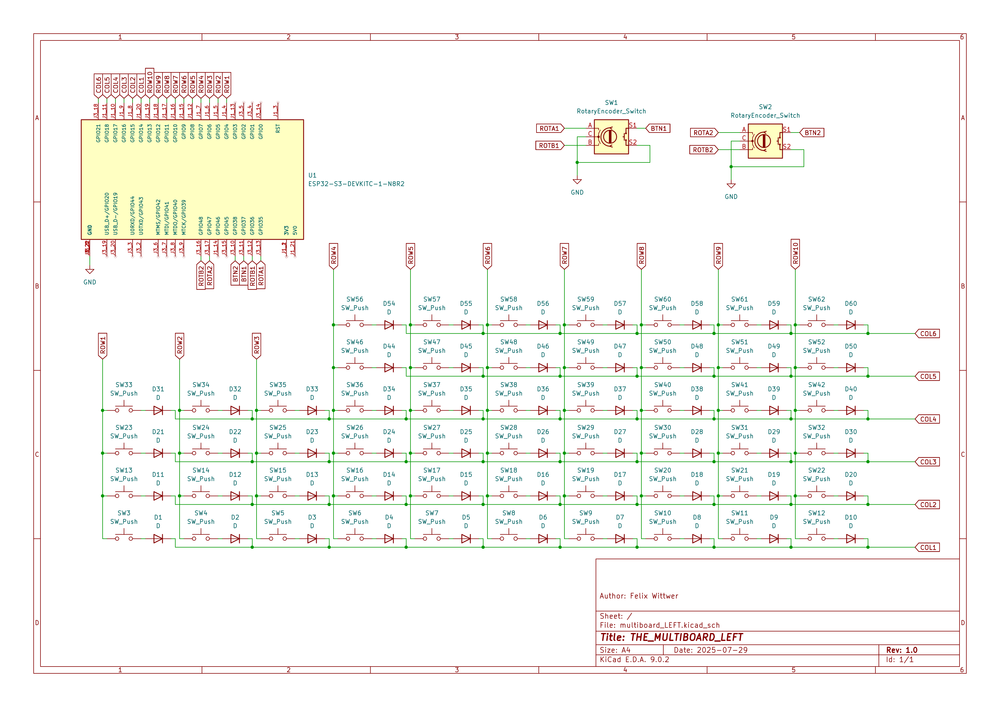

# Journal

Here you can see a documentation of the entire development process.

**Total hours spent: 8h**

## July 29th (4h)

### Session 1 (2h) planing and layout

As a starting point for my custom split keyboard I decided to take some rough measurements of my hand an arrange the keys over it inside Inkscape. I decided on going with a full sized layout with the addition of a macropad and two rotary encoders on the left side. As someone who is coding on a daily bases it was important for me to have a full sized Layout and all the functions keys. If I decide that I do not need the numpad on the right side it can be easealy turned into a second macropad as on the left. For the microcontroler I decided on going with two ESP32-S3s because I use them a lot and they are relatively cheap. Besides that most dev boards also provide two USB ports so I can link them together in teh future via a simple USB C cable. I mean the plan is wireless but to make it futureproof. Pesides that I have lots of GPIO and enough computational power for running the firmware. (Plover for Steno might not be that easy to integrate)

  
  

### Session 2 (2h) schematics LEFT

I now started creating the schematics for the LEFT side. Schematic is now done and I can start with designing the PCB. I think it is probably smart to design the PCB for the left side first and the copy the PCB and use it for the right side. So later on I only need to make few changes to the schematic and the PCB is almost finished for the right side. I will probably need to make 4 PCBs or more to also be like the front and backplate of the keyboard. The housing then will be pretty minimal. I mean I kind of like the look of it but we will see.

## July 30th (4h)

### Session 1 (4h) creating left PCB

Getting everything placed where I wanted took some time and until now I also havent fogured out how to rotate multiple elements in KiCad with a specific angele so rotating stuff also took a while :). Due to rotating the footprints for the keyswitches I was also abte to fit the ESP on teh back side of the board without needing to make the PCB even bigger than it already is.

