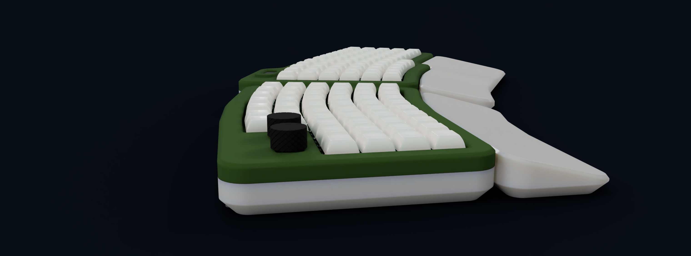

# the_multikeyboard

A custom keyboard that does it all. Standard keyboard, steno keyboard and macropad. It is a 115% keyboard that is a true alrounder. Besides all the features it exells your typing experience by hafing a slightly curved shape and some cool wrist rests that attatch magneticaly.

## About the project

I am actually someone that is currently learning steno myself and I already have a matching keyboard for that. Besides I also have a Macropad and of course a normal keyboard. You counted right I have three keyboards on my desk and this is bothering me. Thats why I decided to build my first own custom keyboard that combines all three. **THE MULTIKEYBOARD** is a keyboard that consists of a macropad (on the right side), a full sized keyboard (everything else :]) and a section in the middle that can be used for stenography typing.

[Look at some cool renders ](#renders) 

[... some CAD](#cad)

[... all the nice features](#features)

[... the PCB](#pcb-and-schematics)

[... the firmware](#firmware)

[... all the parst you need (BOM)](#bom)

## The project

### Renders

    
      

    
    

    
    

### CAD

### Features

**magnetic wrist rest**

Magnets are getting pressed into their location on the keyboard side and get clamped down by the crews holding the top and bottom piece of the keyboard together. On the wrist rest side the magnets just get glued into place. This designvhoice was intentional. I knwo that it is possible to encase magntes by pausing your 3D printer and the resuming but the case is already difficula enough to print due to its size so I don't wanted to add another hurdel.

**OLED**

The keyboard also has a small 0.91" OLED screen that tells you which layer you are currently using. In the future I will maybee add some small pixelart.

**dials with knurling**

The left side of the keyboard is basically a macropad with 16 kustomizable keys and two rotary encoders witha custom dial. The knurling on the dials is probably going to feel amazing.

**steno capabilities**

I intentionally designed the kyboard to be steno capable and also have a layout that could fita steno keyboard.

(blue -> macropad, magenta -> steno, green -> numpad)

### PCB and schematics

    
    

  
  

  
  

## Firmware

The keyboard is running KMK have a look [here](/firmware/).

## BOM

**sum: 79.67 USD**

| part name | amount | price | link | note |
| --------- | ------ | ----- | ---- | ---- |
| Rotary encoder EC24 | 2 | 1.32 USD | https://de.aliexpress.com/item/1005006894514858.html?spm=a2g0o.productlist.main.2.7f3151dbLgFP04&algo_pvid=9129263f-29b5-45c7-9270-6505827be216&pdp_ext_f=%7B%22order%22%3A%2212%22%2C%22eval%22%3A%221%22%7D&utparam-url=scene%3Asearch%7Cquery_from%3A | look out for the EC numer it is importent for the resolution of the encoder 
| Keyswitches | 120 (54+66) | 21.12 USD | https://de.aliexpress.com/item/1005006091988869.html?spm=a2g0o.productlist.main.11.54f5116676VXSy&algo_pvid=5683f259-8333-46de-8018-3bd4b785d0da&pdp_ext_f=%7B%22order%22%3A%22205%22%2C%22eval%22%3A%221%22%7D&utparam-url=scene%3Asearch%7Cquery_from%3A
| Keycaps | 120 (54+66) | 7.88 USD| https://de.aliexpress.com/item/32842379355.html?spm=a2g0o.productlist.main.13.19dd3939CSNGEC&algo_pvid=53737e4f-6131-4c20-955c-c0b48daf2625&pdp_ext_f=%7B%22order%22%3A%2286%22%2C%22eval%22%3A%221%22%7D&utparam-url=scene%3Asearch%7Cquery_from%3A | please look where you can buy matching quantities 120 Keys is larger than normal keyboard size
| hotswap socets | 120 (54+66) | 12.92 USD | https://de.aliexpress.com/item/1005007476614771.html?gatewayAdapt=glo2deu | ---- |
| diodes SOD-123 | 120 (54+66) | 2.74 USD | https://de.aliexpress.com/item/1005004664827360.html?spm=a2g0o.productlist.main.2.730d3027Xsqwva&algo_pvid=82ad0fed-5a2a-47ba-b2ca-b1062569d1e1&pdp_ext_f=%7B%22order%22%3A%2215%22%2C%22eval%22%3A%221%22%7D&utparam-url=scene%3Asearch%7Cquery_from%3A | ---- |
| headphone jack | 2pcs | 1.16 USD | https://de.aliexpress.com/item/4000661908135.html?spm=a2g0o.productlist.main.6.13bb1c8aFr9YPX&algo_pvid=a0e2646d-b512-4a32-a7a1-672e32ca9da6&pdp_ext_f=%7B%22order%22%3A%22166%22%2C%22eval%22%3A%221%22%7D&utparam-url=scene%3Asearch%7Cquery_from%3A | ---- |
| magnets 10mmx2mm | 8 | 1.16 USD | https://de.aliexpress.com/item/1005009238165372.html?spm=a2g0o.productlist.main.5.22047957vqqfP9&algo_pvid=c622bad2-8ed7-4326-9252-e0228163b2aa&pdp_ext_f=%7B%22order%22%3A%22599%22%2C%22eval%22%3A%221%22%7D&utparam-url=scene%3Asearch%7Cquery_from%3A | ---- |
| ESP32-S3 | 2 | 15.12 USD | https://de.aliexpress.com/item/1005008209644199.html?spm=a2g0o.productlist.main.2.450b6619Wqsygq&algo_pvid=b6d6b6cd-dfe1-4b51-a066-5df1bfd08fe2&pdp_ext_f=%7B%22order%22%3A%2263%22%2C%22eval%22%3A%221%22%7D&utparam-url=scene%3Asearch%7Cquery_from%3A | ---- |
| 0.96" OLED | 1 | 1.16 USD | https://de.aliexpress.com/item/1005006153887805.html?spm=a2g0o.productlist.main.4.78c6NVUJNVUJnM&aem_p4p_detail=20250731095618221437588698900003594592&algo_pvid=1ea1ca72-3c62-47c2-bed4-becdd3fbee01&pdp_ext_f=%7B%22order%22%3A%2293%22%2C%22eval%22%3A%221%22%7D&utparam-url=scene%3Asearch%7Cquery_from%3A&search_p4p_id=20250731095618221437588698900003594592_1 | ---- |
| PCB LEFT Main | 1 | ~ 5 USD |  https://jlcpcb.com/ | price is subject to JLCs review |
| PCB RIGHT BACK | 1 | ~ 5 USD |  https://jlcpcb.com/ | price is subject to JLCs review |
| | total | 74.67 + (shipping ~5 USD) **79.67 USD** | 

**sum: 79.67 USD**

## Credits

**Thanks for the detailed 3D models!**

Gateron keyswitch 3D model: https://www.gateron.com/pages/3d

Keycap 3D model: https://grabcad.com/library/dsa-keycap-for-cherry-mx-switches-1

ESP32-S3 (before I modified it): https://grabcad.com/library/esp32-s3-module-for-pcb-preview-1